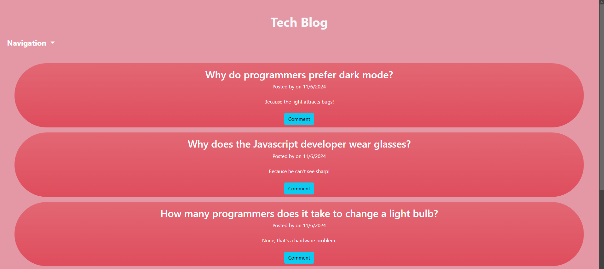

# MVC-tech-blog
MVC Tech Blog

MIT License

## Description

A full-stack CMS-style blog where developers can publish blog posts as well as view and comment on other blog posts.

## Table of Contents

- [Description](#description)
- [Installation](#installation)
- [License](#license)
- [Usage](#usage)
- [Contribution](#contribution)
- [Testing](#testing)
- [Questions](#questions)

## Installation

n/a

## License

[MIT License](https://opensource.org/license/mit)

## Usage

Click [this link](https://mvc-tech-blog-e47b.onrender.com/) to visit a live version of the application. 

## Contribution
SMU Coding Bootcamp

## Testing
n/a

## Questions

My GitHub: [treytaylersmith](htthttps://github.com/treytaylersmith)

Email me with any additional questions at treytaylersmith@gmail.com

